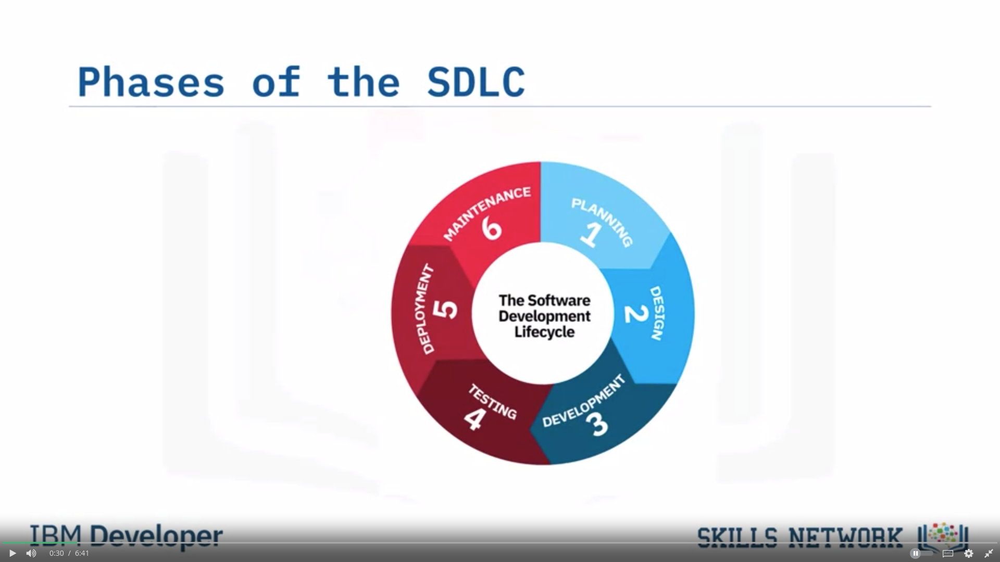

## SDLC

1. There are generally 6 phases of SDLC.

2. Tasks from previous phase do not overlap with next stage.

### Stages

1. #### Planning (Requirements, strategy, analysis):

   1. Requirements are gathered, analysed, documented and prioritized.

   2. Factors that need to be looked:

      1. Purpose
      2. Users
      3. QA
      4. Regulatory compliances
      5. Resourcing
      6. Input / Outputs
      7. Scheduling
      8. etc.

   3. Time constraints and budget costs are estimated for givern requirements.
   4. Team members are proposed with well defined responsiblities.
   5. If requirements are not clear, a prototype (small scale replica) can be made to test design ideas.
   6. Software requirements specifications (SRS) document:
      1. Requirements are gathered.
      2. All stakeholders must agree.

2. #### Design

   1. Requirements are gathered from SRS to develop architecture.
   2. A prototype can be made to demonstrate to all stakeholders.
   3. A DESIGN DOCUMENT is made before development phase can be started.

3. #### Development Phase

   1. Also known as building aor implementing stage.
   2. Programming languages, stacks and tools are detetrmined.
   3. Team members are assigned their tasks.

4. #### Testing

   1. Code is tested to ensure stability and security and that it meets requirements from SRS document.
   2. Bugs are reported, tracked, fixed and retested.
   3. Automatic and manual testing.
   4. Types: Unit, System, Integaration and acceptance

5. #### Deployment

   1. Code is made available to users.
   2. We can also push it to user acceptance testing environment before releasing in prodcution.

6. #### Maintainence

   1. New and changing requirements, Other bugs, Code enhancements and user interface issues.
