#### Software Testing

1. What is software testing ?
     
   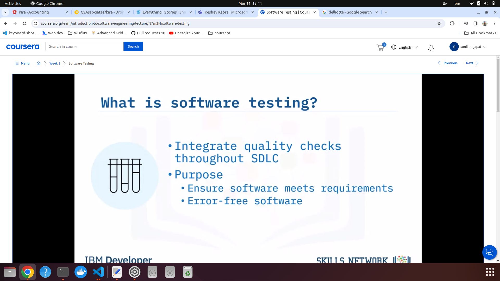

   1. Need to write test cases before coding process.   
      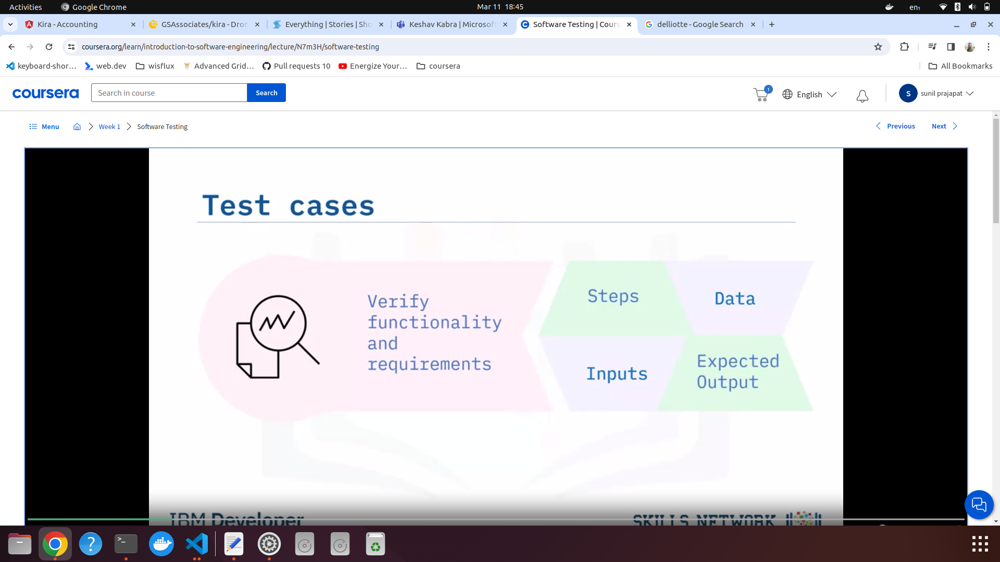

   2. Types of testing   
      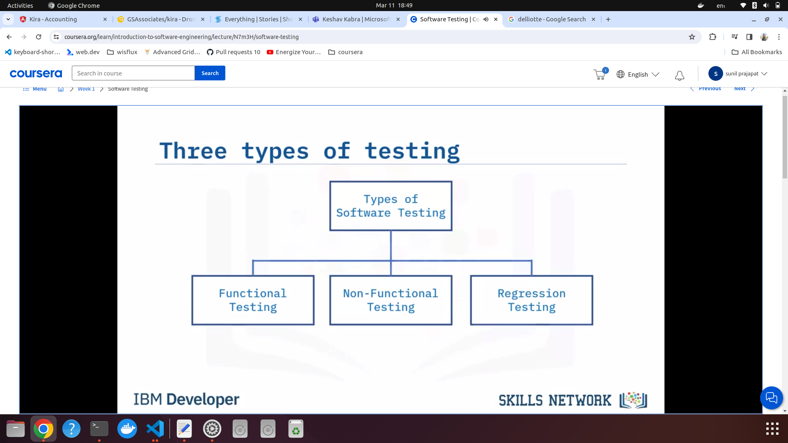

      1. Functional testing   
         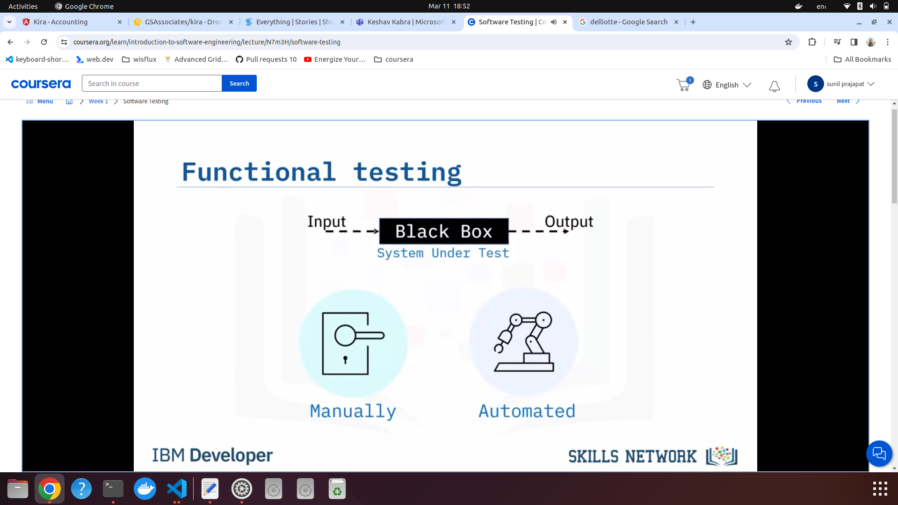   

         Purpose of functional testing  
         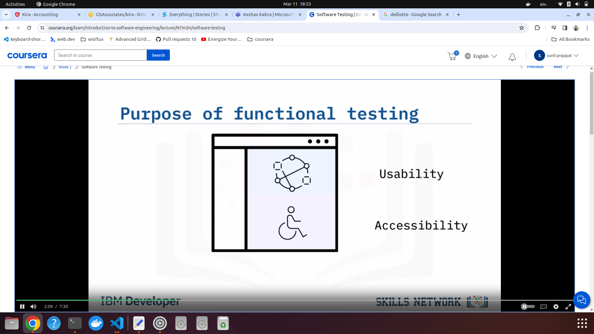  

      2. Non functional testing
         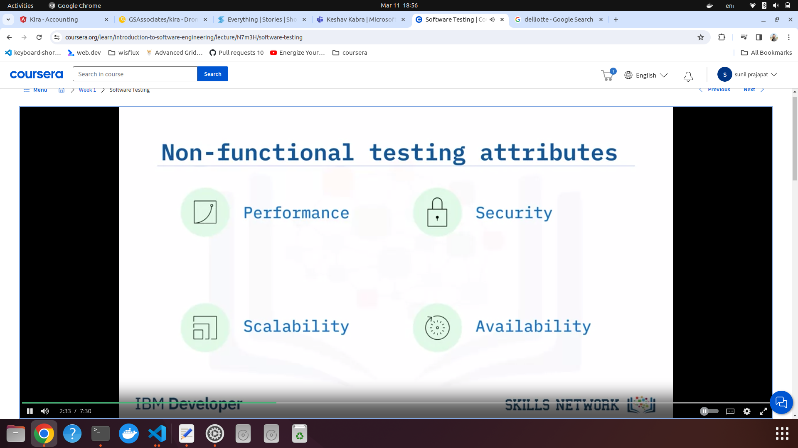   
         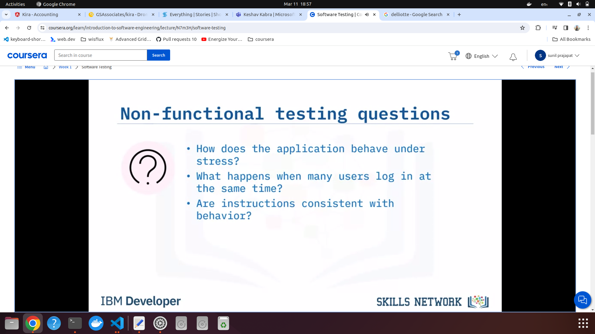   
         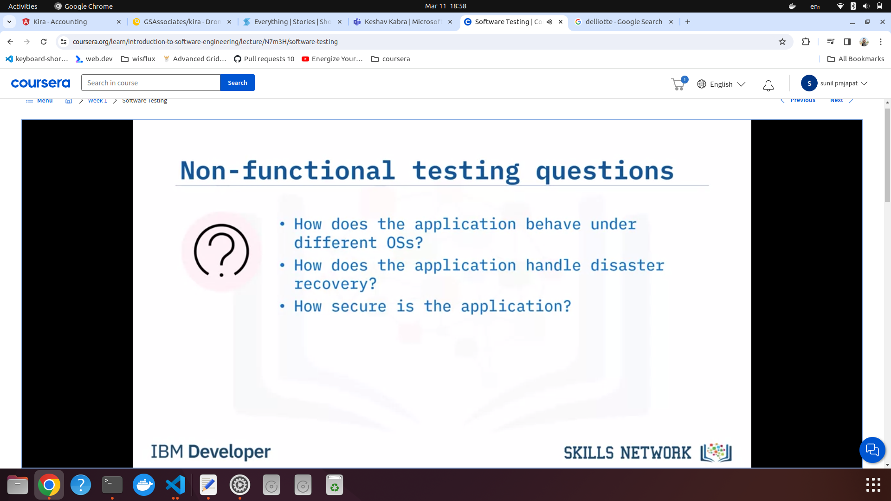   

      3. Regression testing
         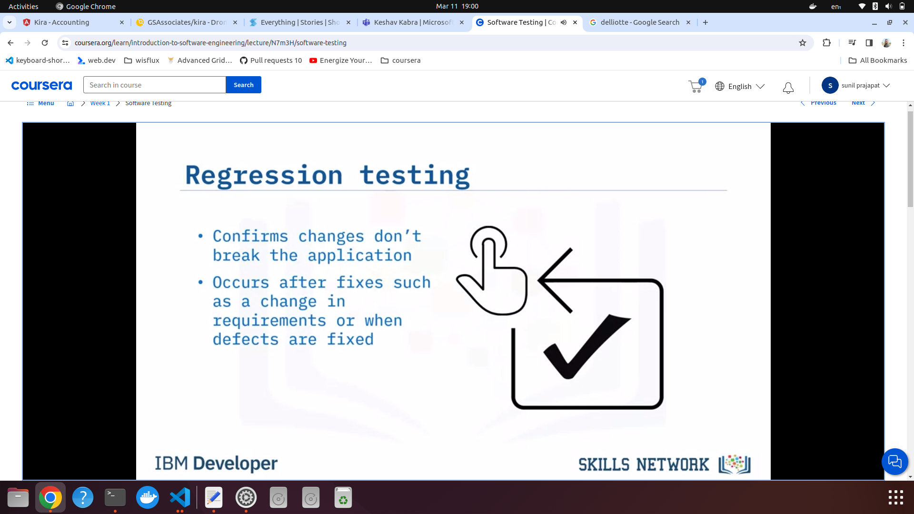
         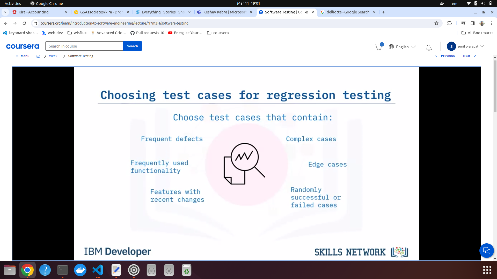

2. Testing Levels:
   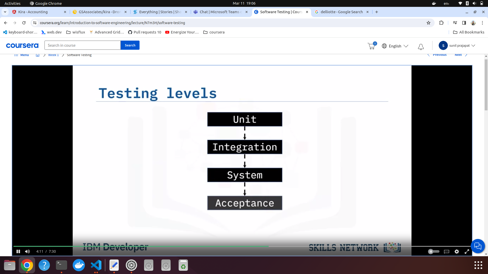   
   1. Unit testing: Test smallest component of isolated code.
      
   2. Integration testing: The whole component (software module) is tested.Diffrent software modules can also be tested as one.
      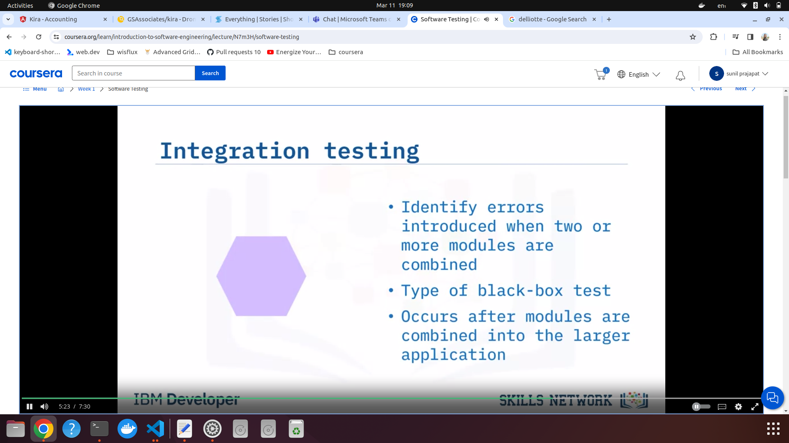   
      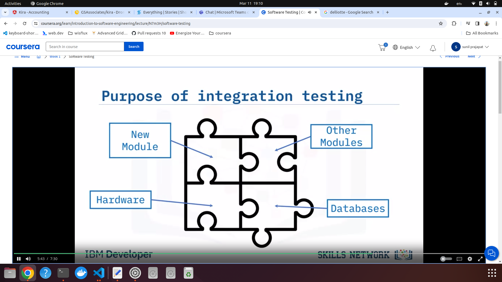   
   3. System testing: To test whether system functions well as a whole.
      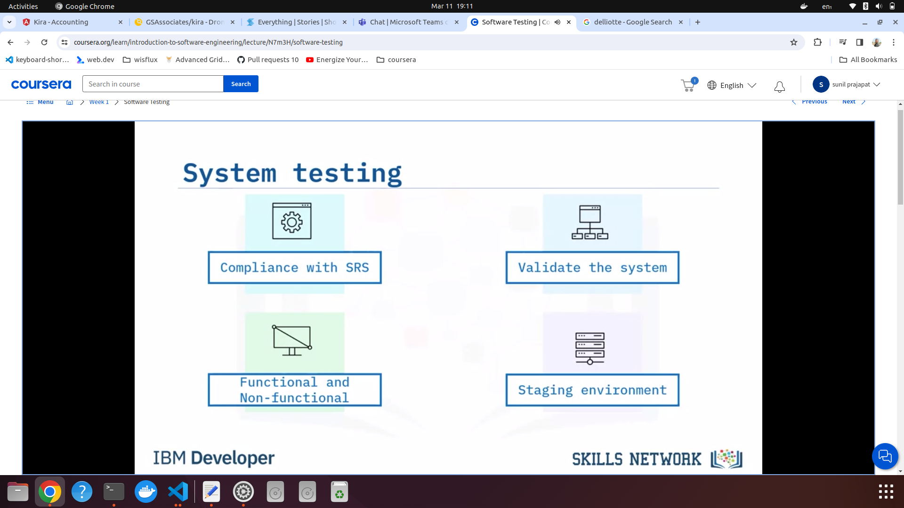   
   4. User acceptance testing (BETA testing): tested by end users. Done during maintenance stage.
      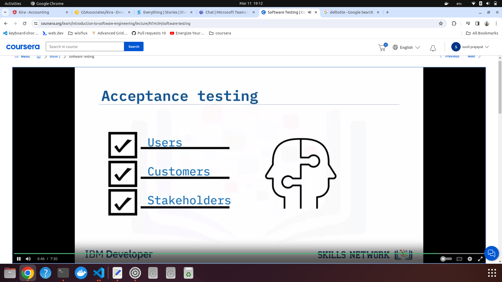   
