#### Steps to gathering requirements

1. Identifying stakeholders
2. Establishing goals and objectives
3. Eliciting requirements from the stakeholders
4. Documenting the requirements
5. Analyzing and confirming the requirements
6. Prioritizing

##### Identifying stakeholders

Have a representative from every group that the software affects.
 
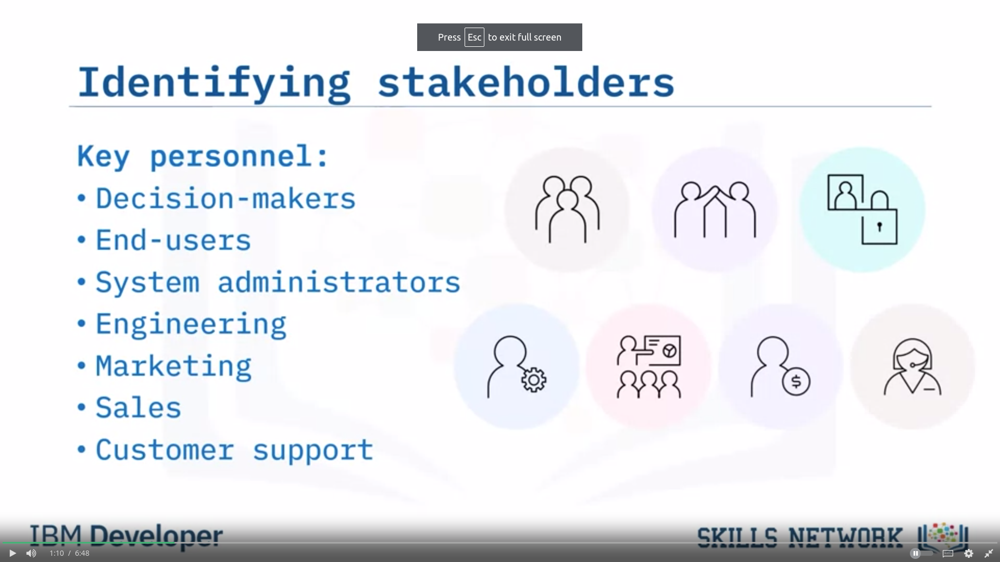

##### Establishing goals and objectives

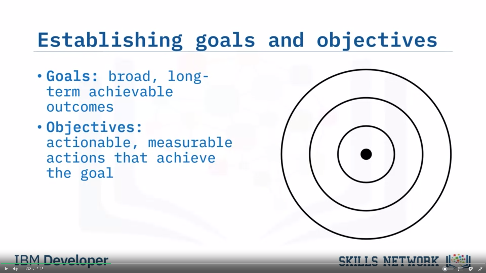

##### Eliciting requirements from the stakeholders

Below steps need to be **ITERATIVELY** performed.
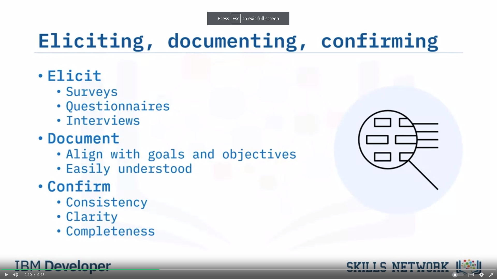

##### 

Requirements should be prioritized.

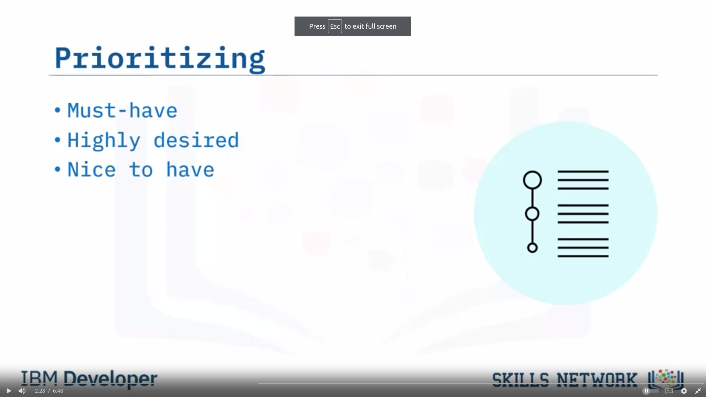

### Three types of Requirements documentation

1. 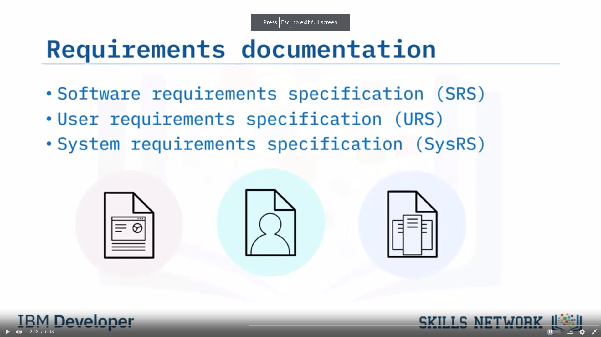

2. Types: 
    1. SRS
        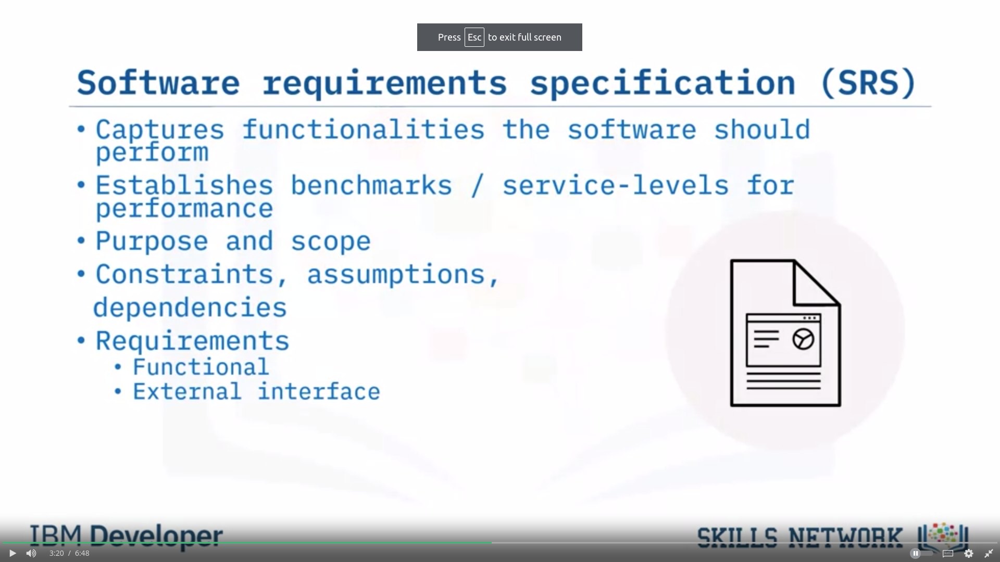   
        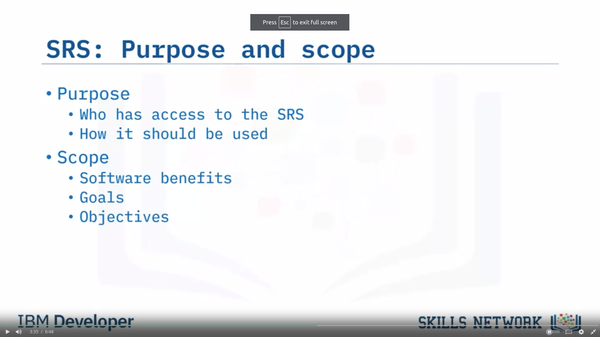   
        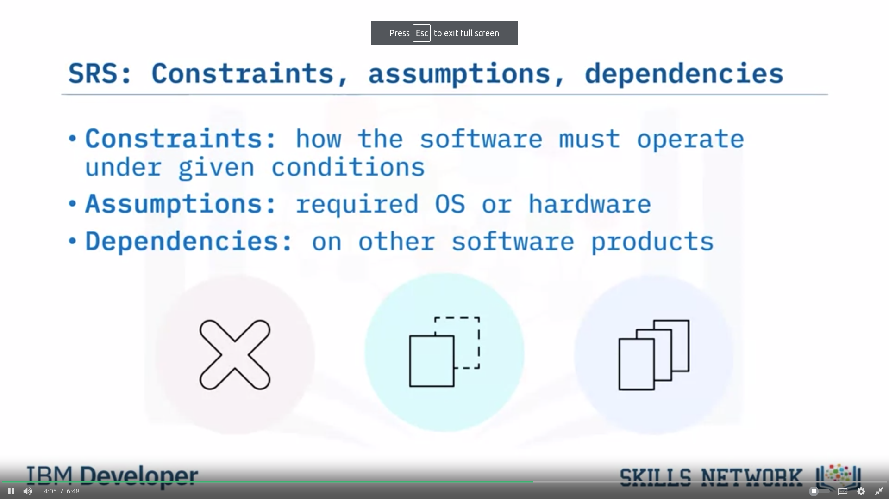   
        Requirements are classified into 4 types:
            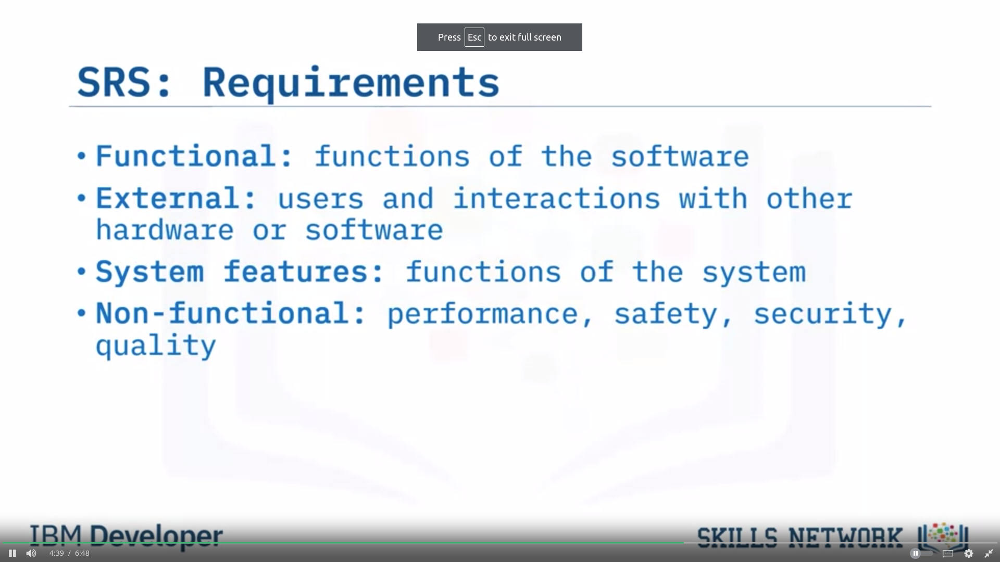

    2. User requirement specification (URS)
        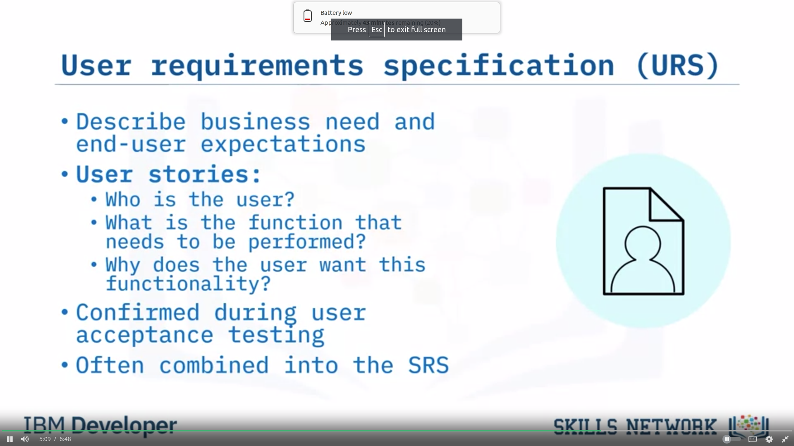

    3. SYstem requirement specification
        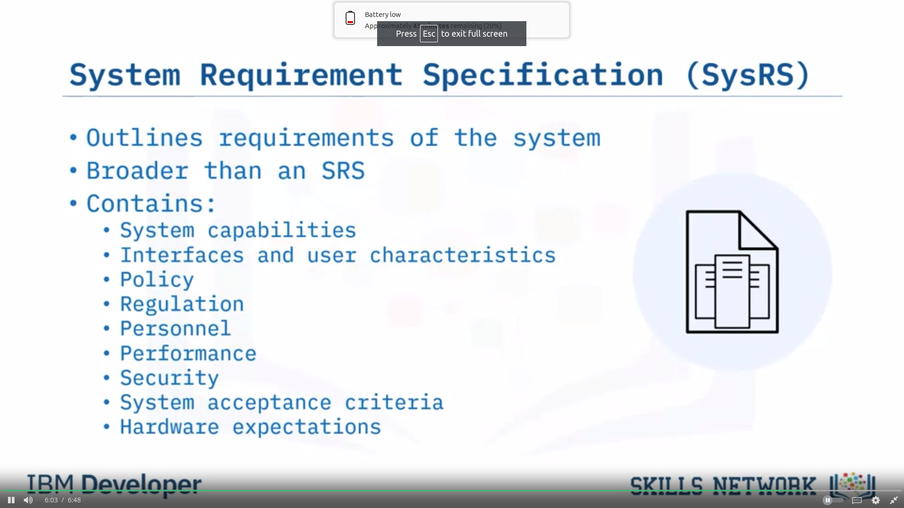