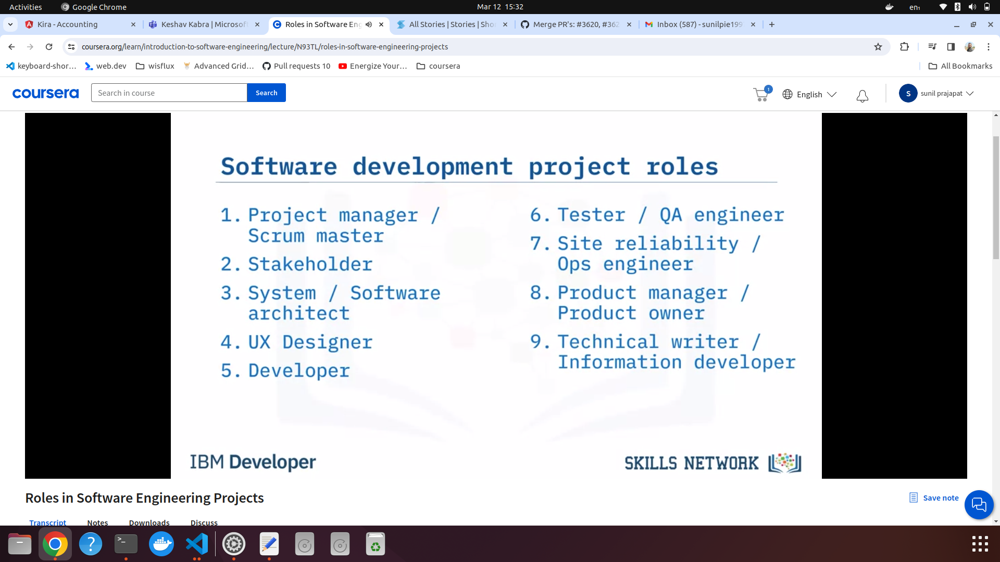
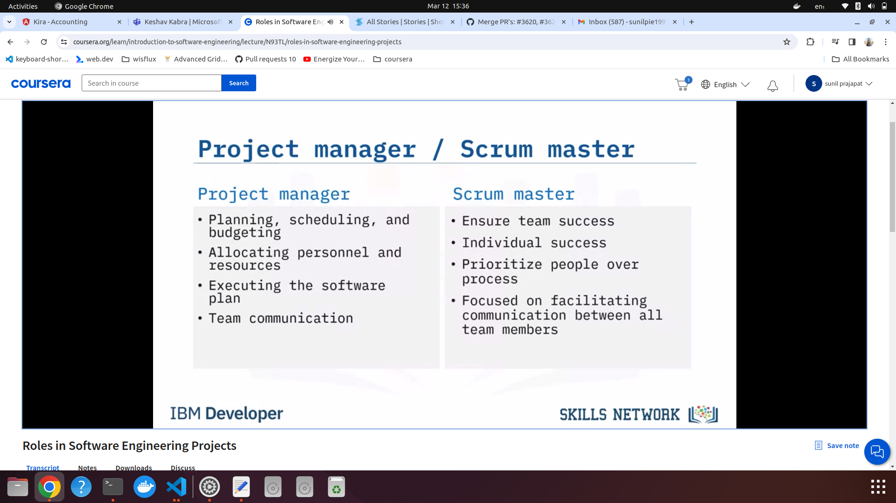
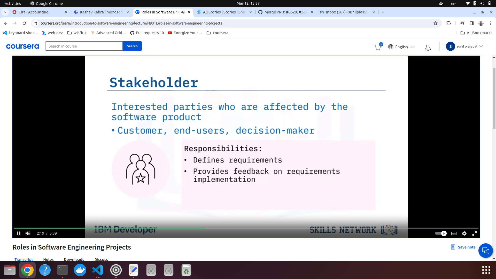
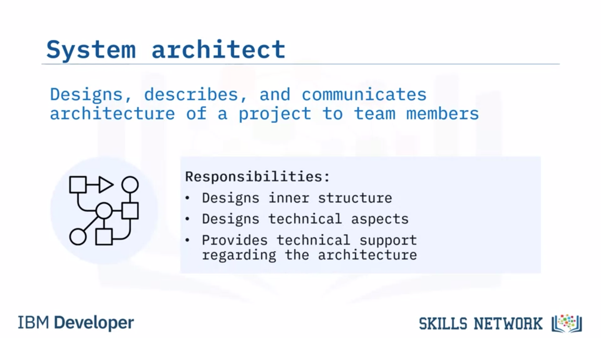
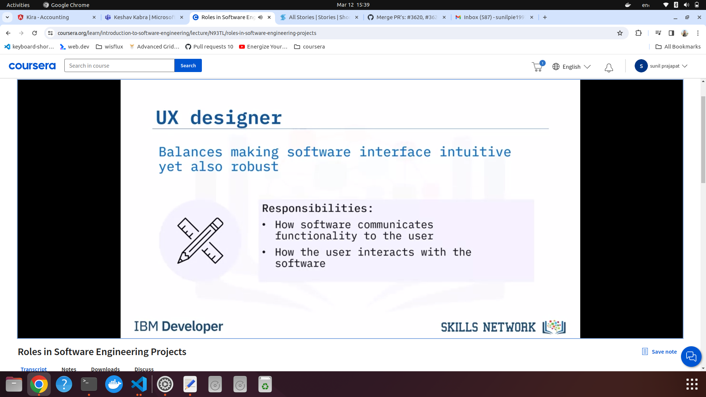
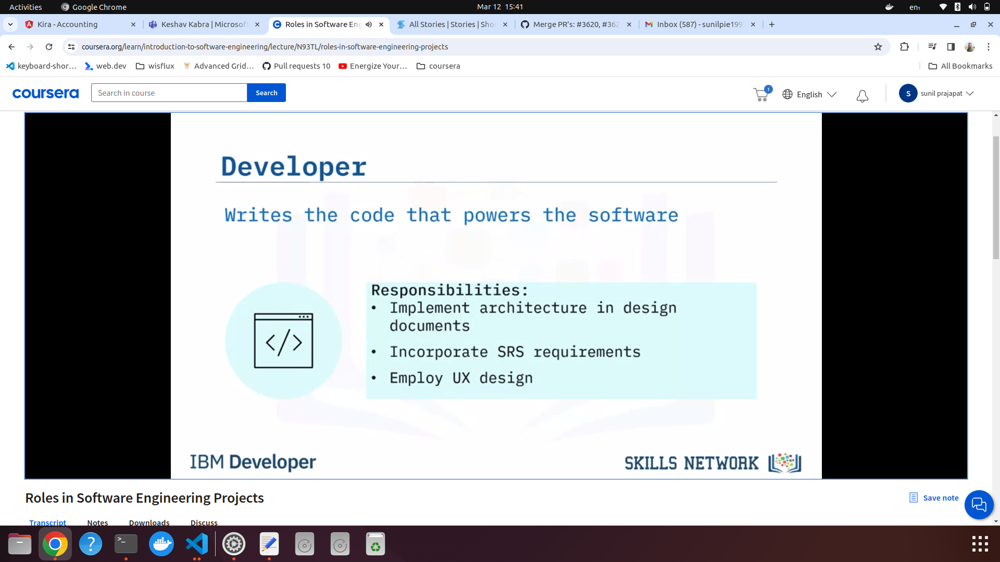
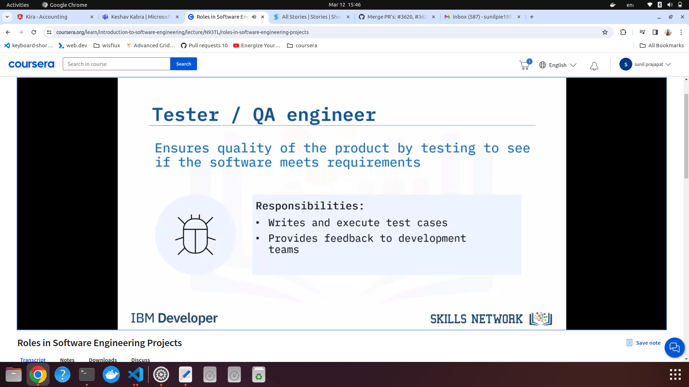
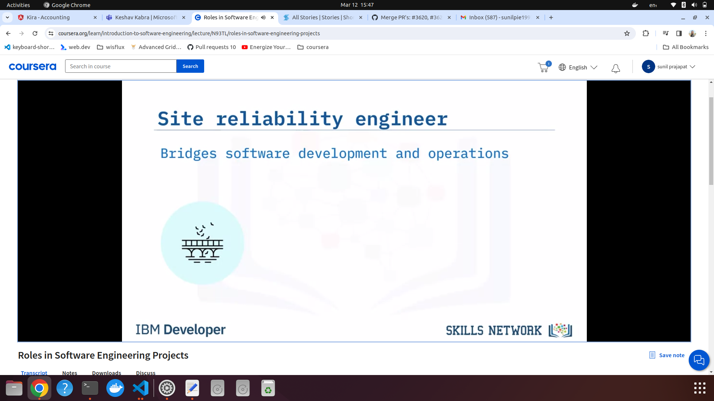
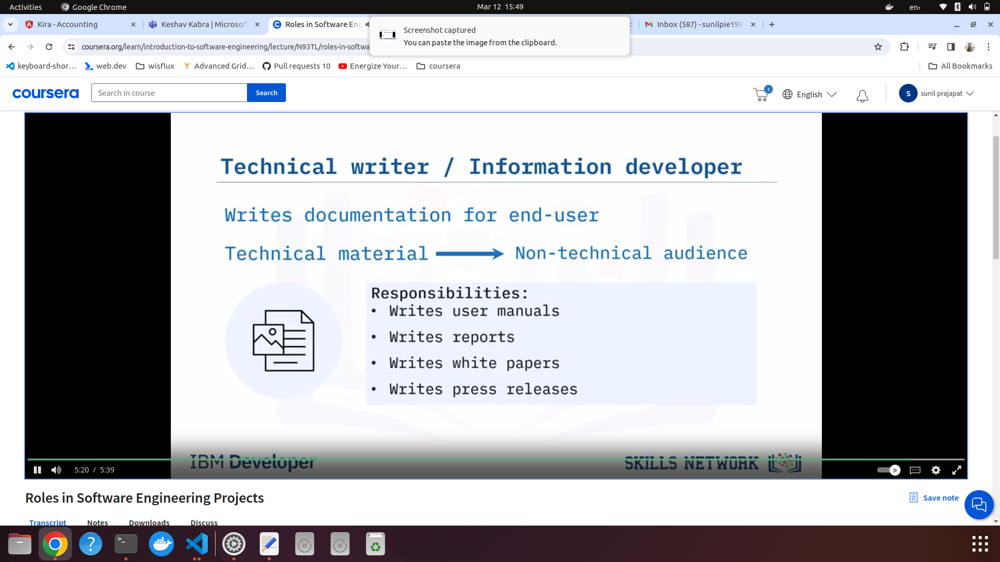

### Software engineering roles

1. Roles:
      

   1. Project Manager (waterfall) / Scrum master (agile)
        

   2. Stakeholder
        

   3. System architect
        

   4. UX designer
        

   5. Developer
        

   6. QA/ Test engineer
        

   7. Site reliability engineer
         

   8. Technical writer
        
