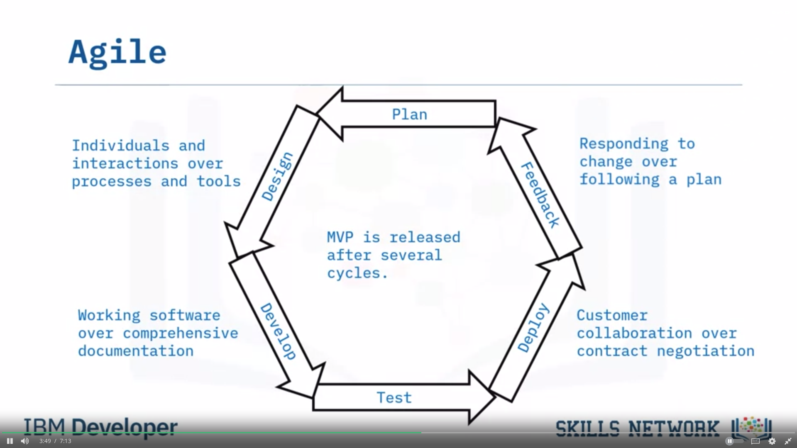
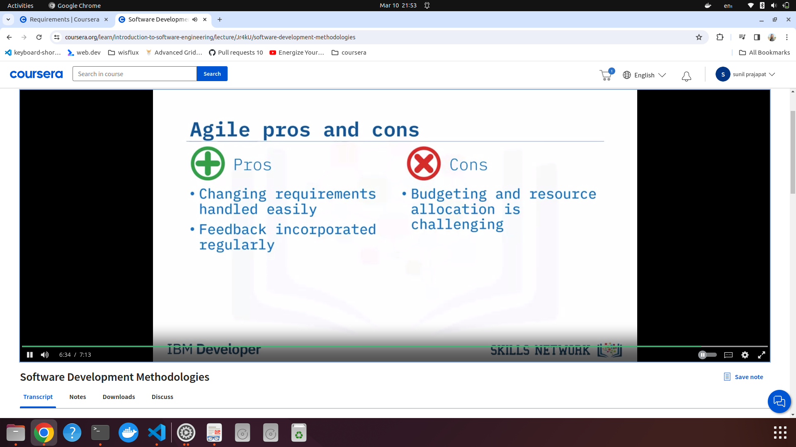

### COmmon development methodologies

1. 

   1. waterfall and v-shape are sequential methodoligies. Here customer feedback is taken after most of the product is built.

### waterfall (sequential)

### V-shape model (sequential)

### Agile (iterative)

1. Agile is a iterative approach instead of sequential approach (waterfall) to incrementally make changes in software to accomodate changing requirements.
2. Software is built in quick shorts bursts of development (sprints) while taking customer feedback regularly.
3. 
4. 
