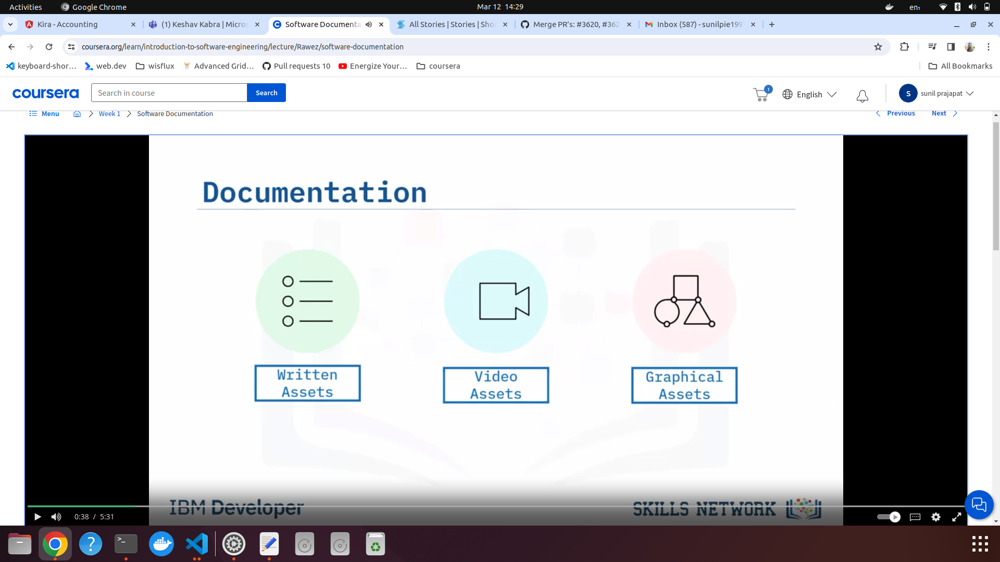
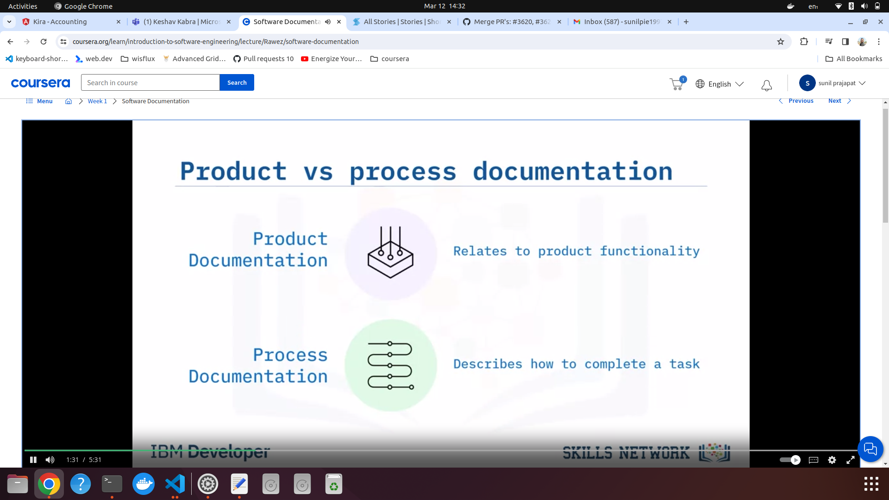
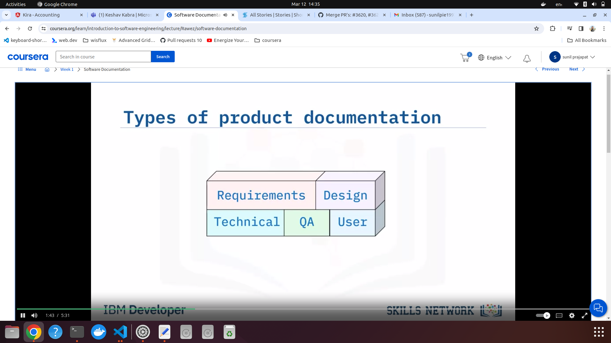
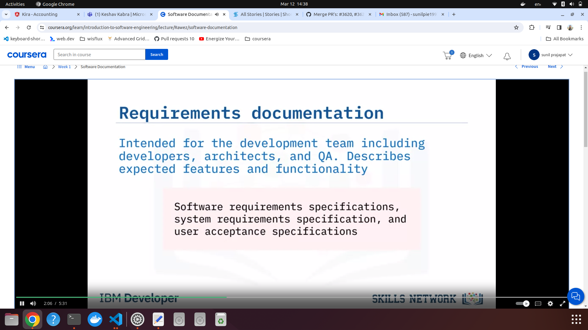
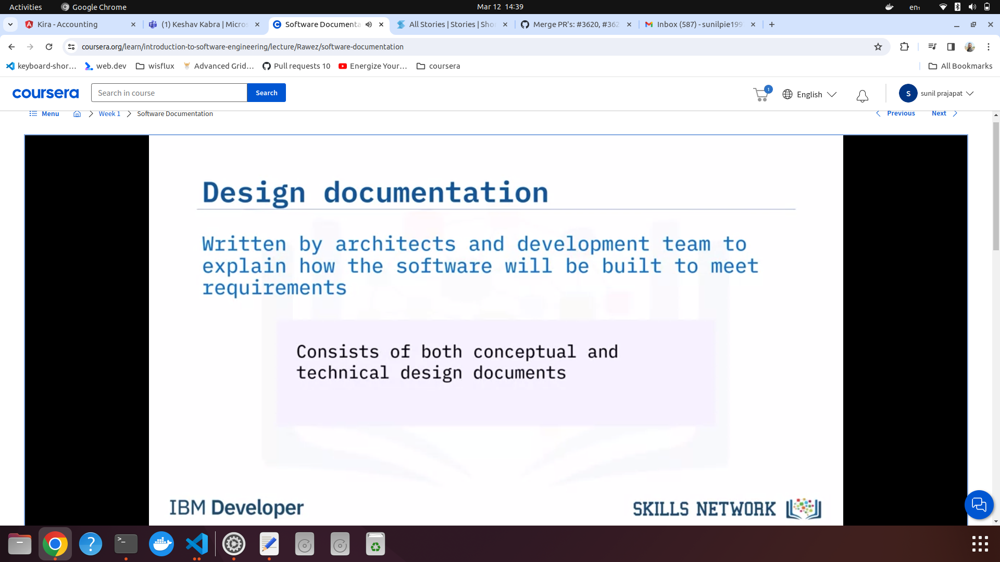
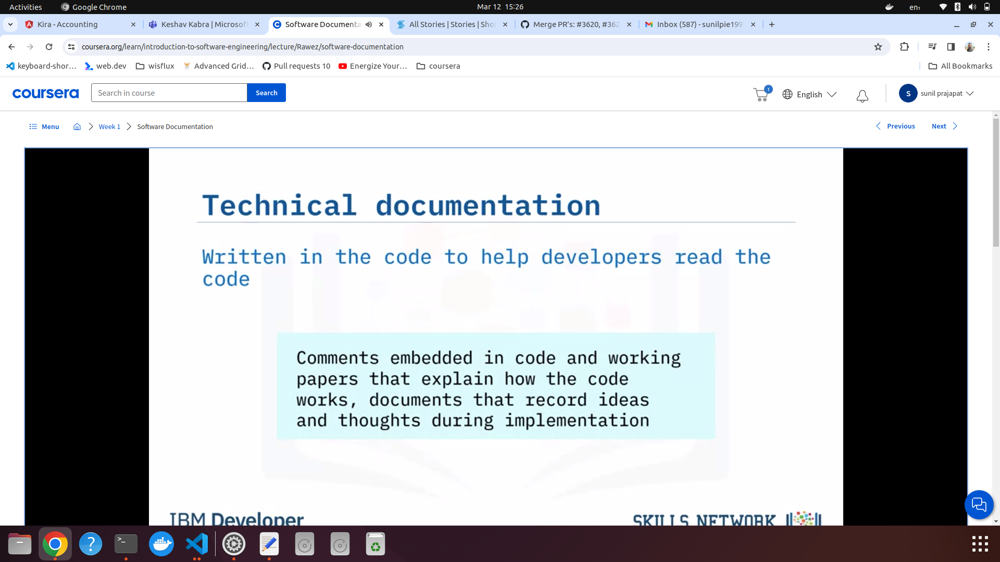
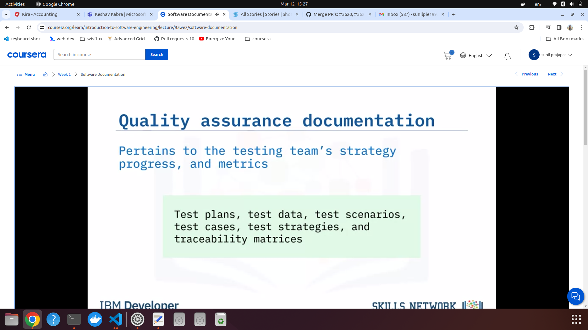
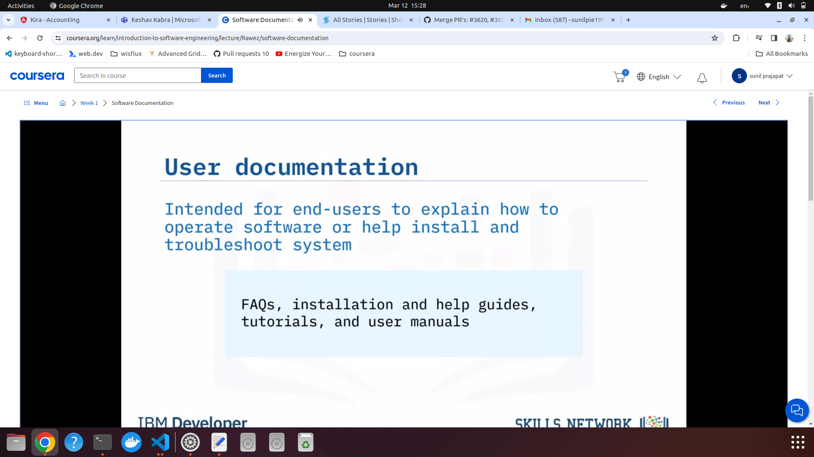
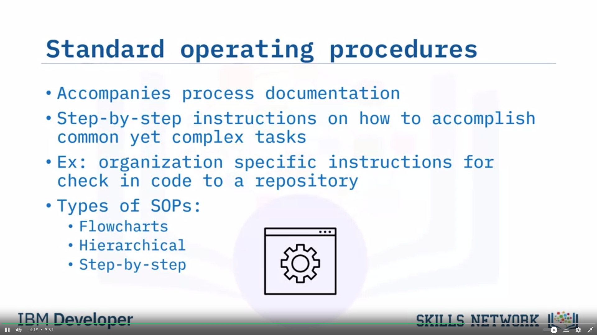

### Software documentation

1. Describes what the product is and how to use it.
     

2. Types of documentation
      

   1. Types of product documenation: Needs to kept up to date
        

      1. Requirements documentation
           

      2. Design doc
           

      3. Technical Doc
           

      4. Quality assurance
           

      5. User docs
           

      6. Standard operating procedures
           
