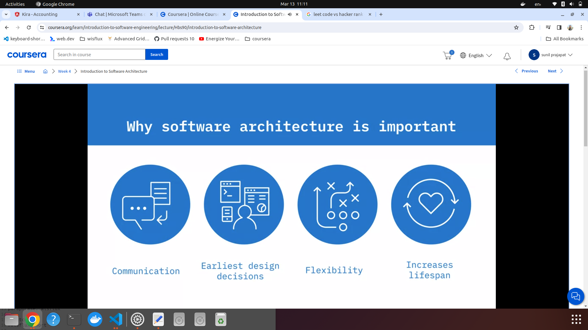
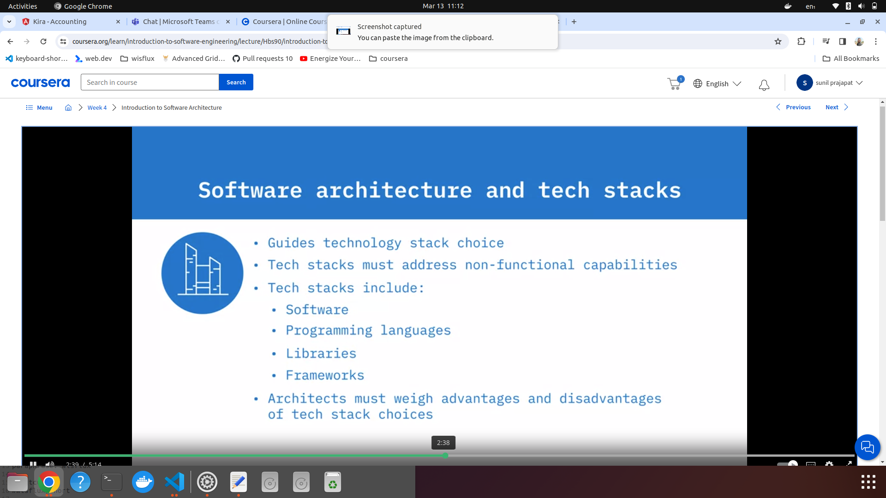
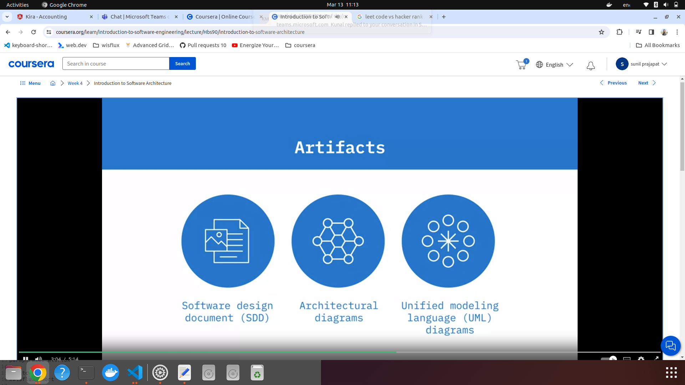
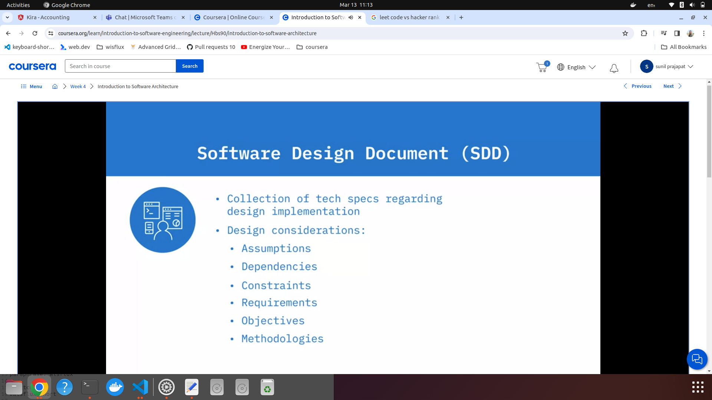
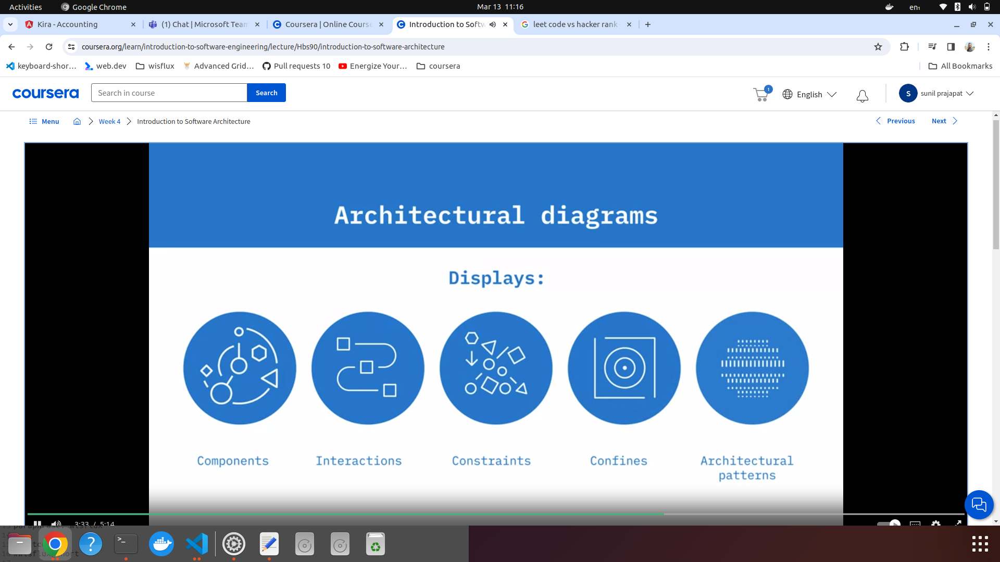
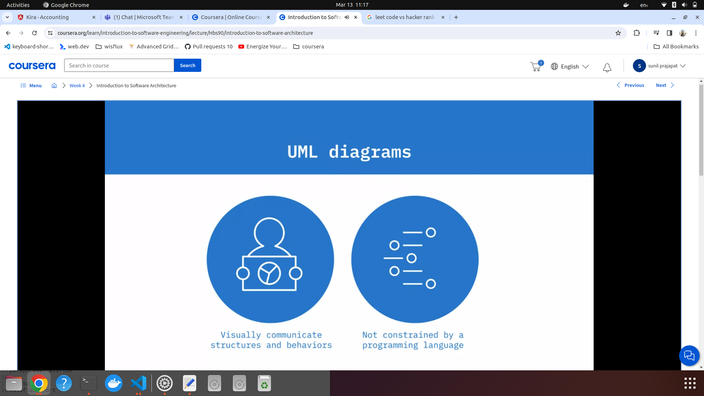
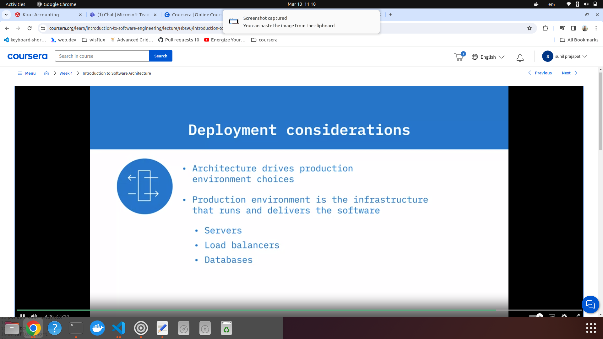

### Architecture

1. Architecture
     
     
     
     

   1. Artifacts (Documents):

      1. Software design documents
           

      2. Architectural Diagrams
           

      3. UML diagrams
           

      4. Deployment considerations
           
