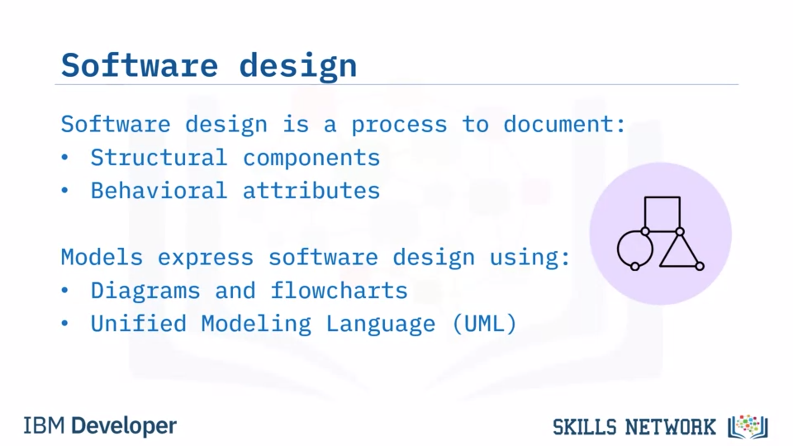
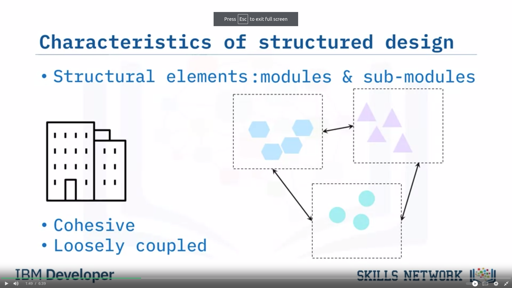
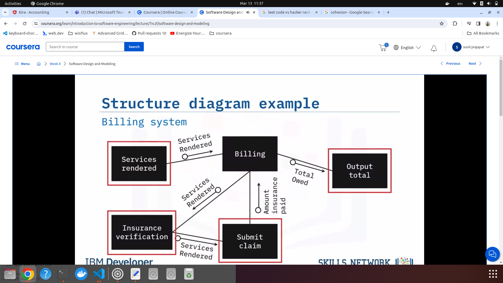
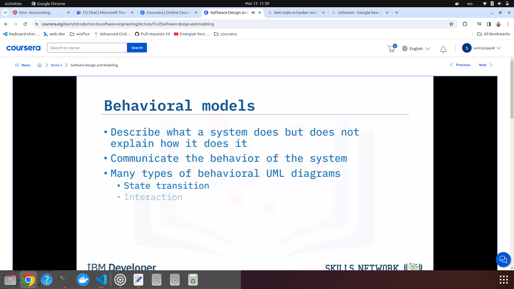
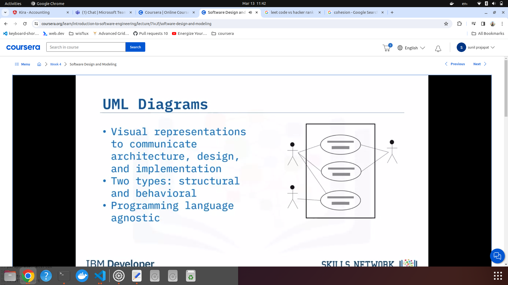
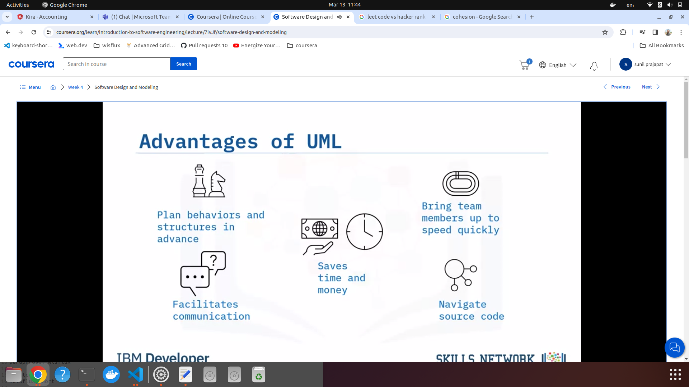
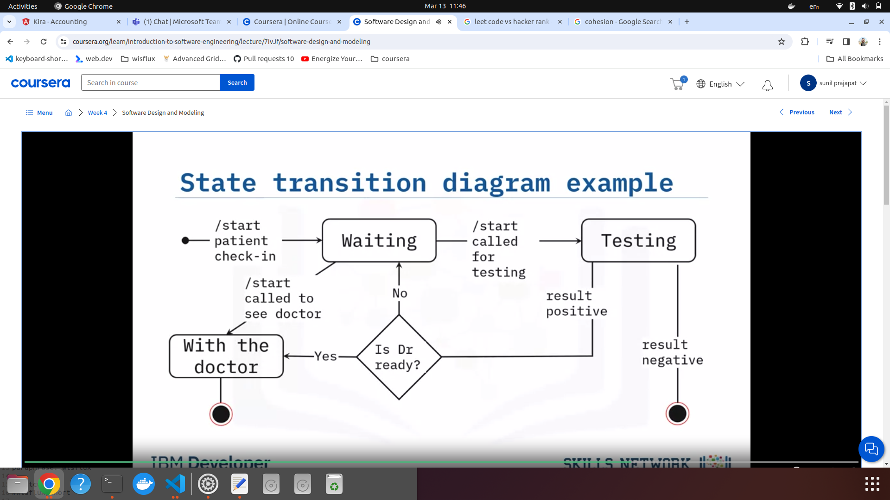
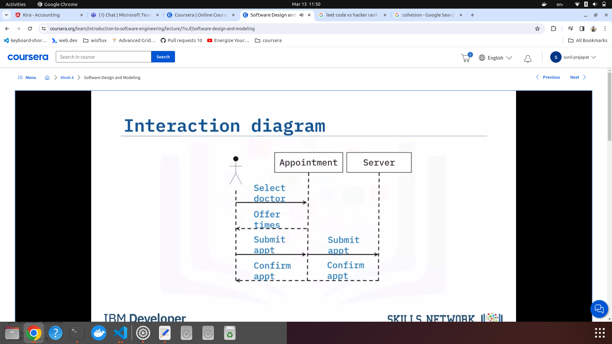

### Software design

1.   

#### Characteristics of structure design

1. Structure models
     

2. Example:
     

#### Behaviour models

1.   
2. UML diagrams
     
3. Advantages of UML diagrams
     
   1. State transition diagram
        
   2. Interaction diagram
        
